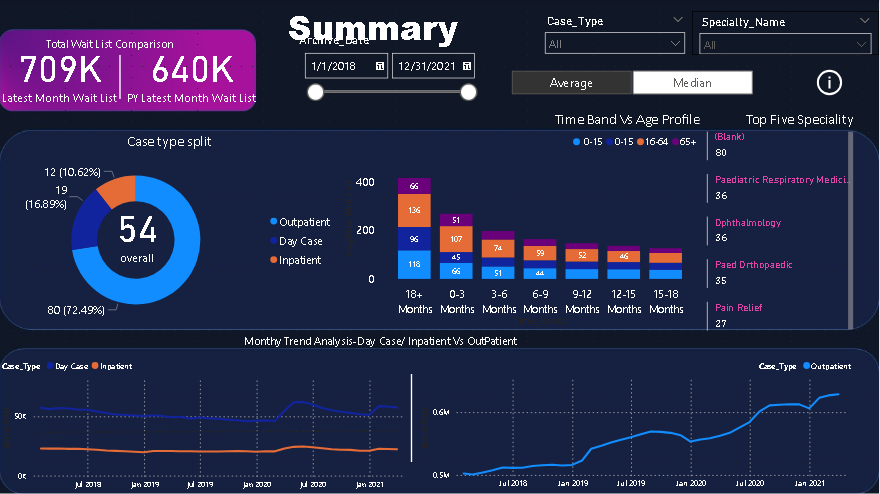
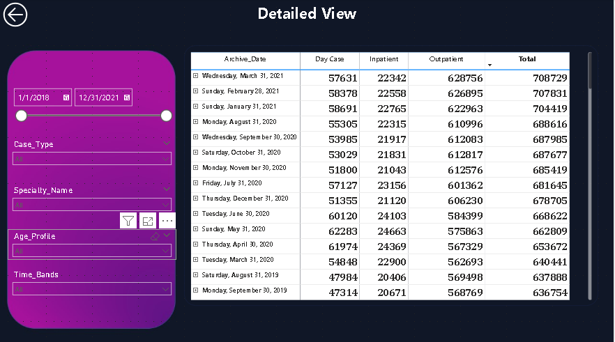
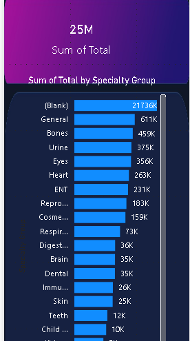

# Patient-Waiting-List [live project](https://app.powerbi.com/links/4h1FOftwBl?ctid=ae6b8ae8-c4ed-48a6-90ac-578b536f4451&pbi_source=linkShare)

## Introduction

In today's healthcare, efficient management of patient waiting lists is crucial for delivering timely and quality care. This project takes advantage of the capabilities of Power BI to track and analyze the current status and historical trends of patient waiting lists, with a specific focus on inpatient and outpatient categories from 2018 to 2022. By utilizing Key Performance Indicators (KPIs) and advanced visualizations, the project aims to provide actionable insights into the dynamics of patient flow in the hospital

### Problem Statement
1. Tracking the current status of the patient waiting List.
2. Analyze the historical monthly trend of the waiting list in inpatient and outpatient categories.
3. Detailed specialty level and age profile analysis.

### Data Sourcing and Transformation
Got the data in different CSV files for the inpatient and outpatient, worked on combining them into one

The image below shows inpatient and outpatient tables are hidden and are combined into one table. IE, All Data.

Created a new table for the media and Average and another one for the  Mapping specialty.

|  | |

### Data Modeling.
Power BI automatically generated the model to show a relationship between the Mapping Speciality table and the All Data table, creating a one to many realationship between the two tables.

### Visualization and Analysis
From the visual, we can see the waiting list has increased, and the outpatient number is higher than the inpatient which is correct because most of the people in a hospital are treated and sent home.
DAX, Drillthrough tooltip, and buttons are utilized in the dashboard.
| |||

### Conclusion and Recommendation
Through the use of KPIs tracking and visualization, I was able to show that there is a growth in the total waiting list in the data scope from 2018-2022. I was also able to show the top five specialities in the hospital. Without more knowledge of the hospital from which the data was gotten am not able to give a correct recommendation.😊😊😊 

