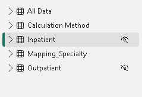
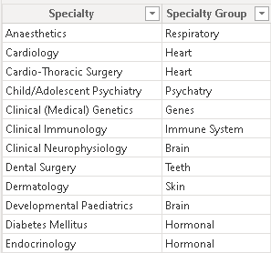
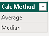
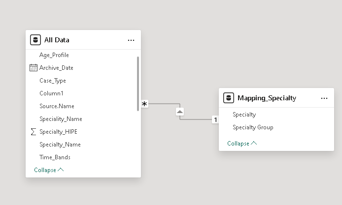

# Patient-Waiting-List
## Introduction
This is my first Power BI data analysis project, Did it as an introduction to the Power BI platform, intending to know the workings of the Power BI Query, Model, and visualization.
### Problem Statement
1. Tracking the current status of the patient waiting List.
2. Analyze the historical monthly trend of the waiting list in inpatient and outpatient categories.
3. Detailed specialty level and age profile analysis.

### Data Sourcing and Transformation
Got the data in different CSV files for the inpatient and outpatient, worked on combining them into one

The image below shows inpatient and outpatient tables are hidden and are combined into one table. IE, All Data.

Created a new table for the media and Average and another one for the  Mapping specialty.
|  | |
|-----------------|------------------|

### Data Modeling.
Power BI automatically generated the model to show a relationship between the Mapping Speciality table and the All Data table, creating a one to many realationship between the two tables.

### Visualization and Analysis
From the visual, we can see the waiting list has increased, and the outpatient number is higher than the inpatient which is correct because most of the people in a hospital are treated and sent home.
DAX, Drillthrough tooltip, and buttons are utilized in the dashboard.
|  | |![](calc_Methd.png |
|--------------- -|------------------|

